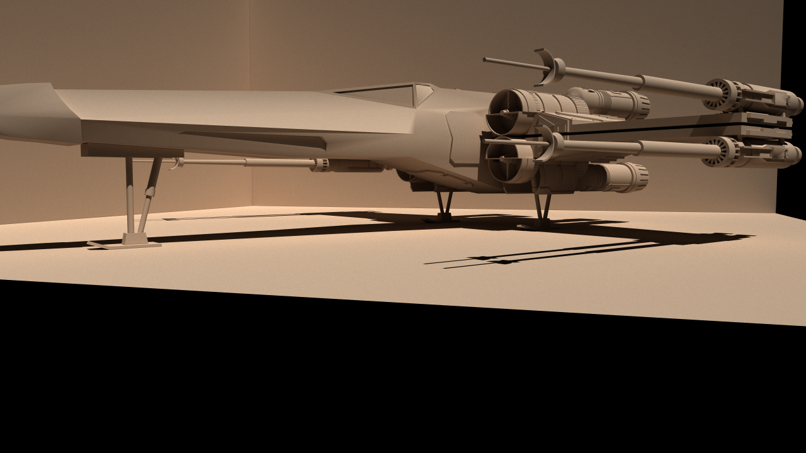
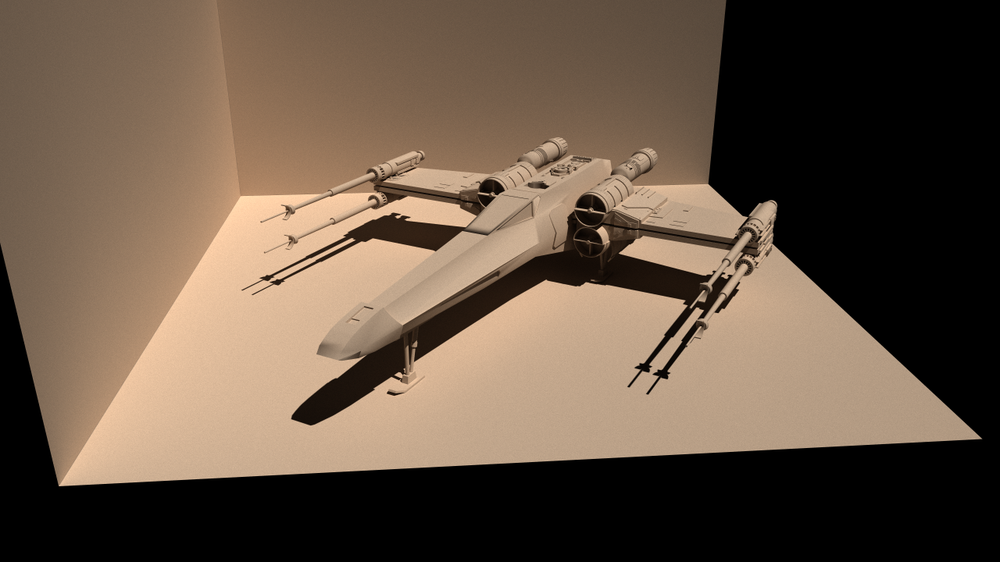
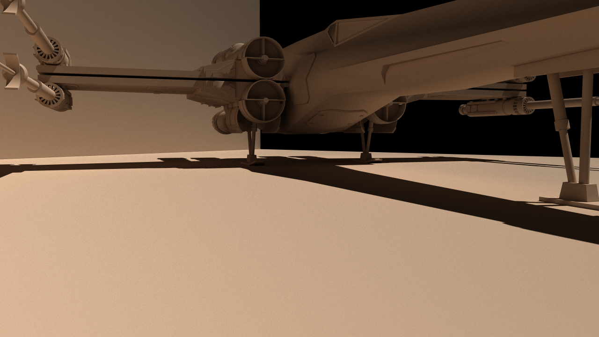
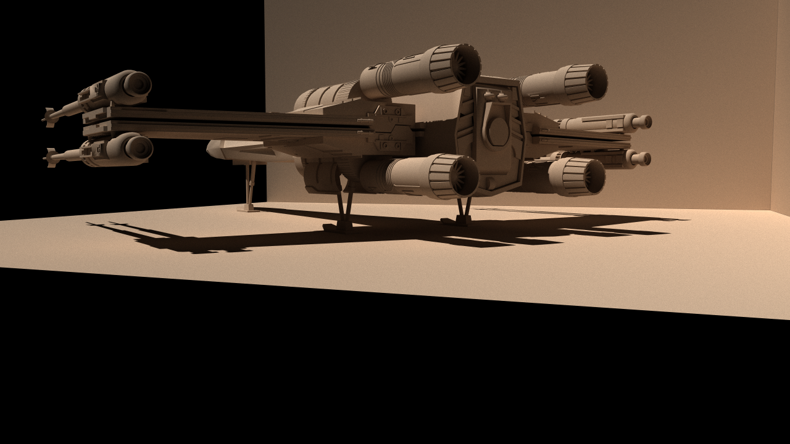
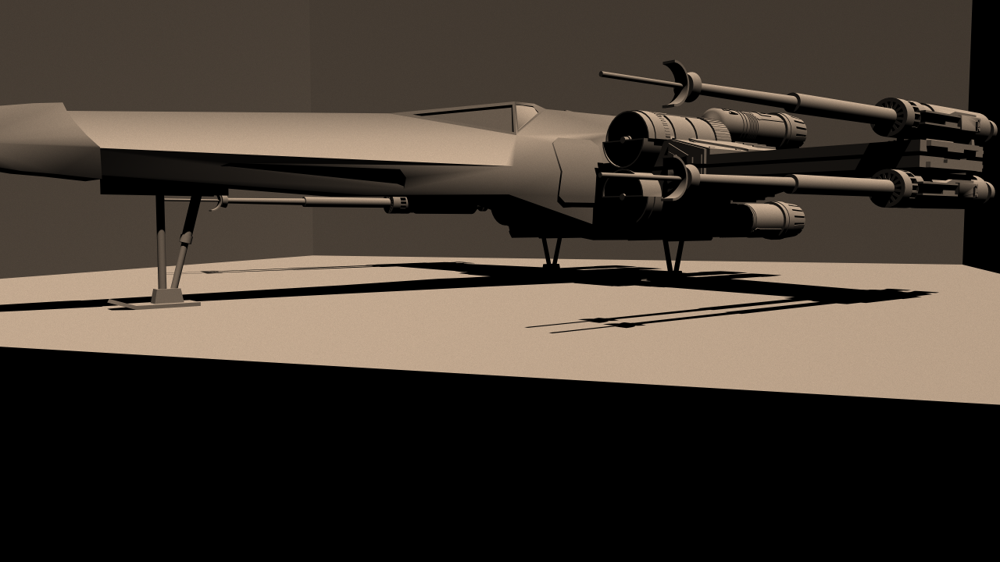
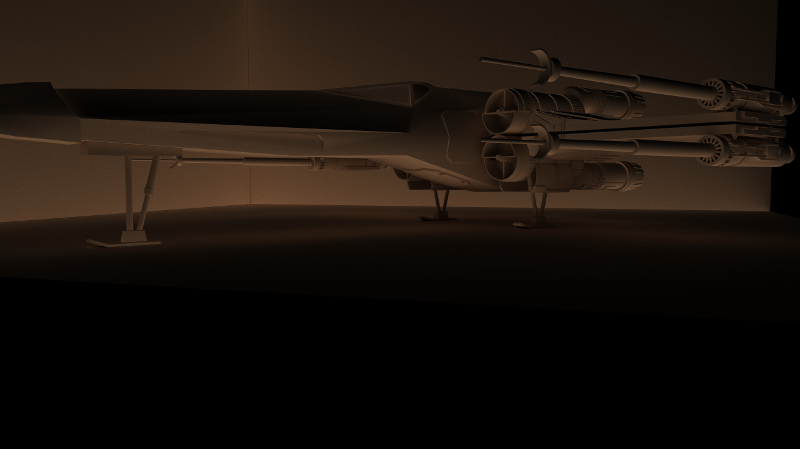

Light Bender
============

Testbed for NVIDIA OptiX




Download
--------
Make sure to clone all submodules as well:

```bash
git clone --recursive https://github.com/LoganBarnes/LightBender.git
```

If the project was already cloned without submodules use this command from the root folder:

```bash
git submodule update --init --recursive
```


Environment
-----------

Ensure the OptiX SDK locations are added to the environment paths before attempting to build and run.

On Unix this can be done by adding the following lines to your .bashrc, .profile, etc. (or manually typing them into the terminal each time).

```bash
# CUDA environment
export PATH=<path/to/your/cuda>/bin:$PATH
export LD_LIBRARY_PATH=<path/to/your/cuda>/lib64:$LD_LIBRARY_PATH

# OptiX
export OPTIX_SDK=<path/to/your/optix/sdk>
export LD_LIBRARY_PATH=$OPTIX_SDK/lib64:$LD_LIBRARY_PATH
```

On Windows you will have to set environment variables through the environment variables GUI.

Once the environment variables are set, run the appropriate *configureAndBuild* script from the *run* directory via the terminal or console.


Unix
----

```bash
cd run
./unixConfigureAndBuild.sh
./bin/runLightBender
```


Windows
-------

```bash
cd run
winConfigureAndBuild.cmd
bin\runLightBender.exe
```


Manually via CMake (platform independent)
------------------------------------------

```bash
cd run
mkdir _build
cd _build
cmake -DCMAKE_GENERATOR_PLATFORM=x64 ../..
cmake --build . --config Release
```

This will create the executable ```run/_build/runLightBender``` on Unix and ```run\_build\Release\runLightBender.exe``` on Windows.


Renderings
----------

### Images showcasing the current status of the project





#### Direct illumination (directly from a light source):


#### Indirect illumination (light scattered and reflected off objects):


#### Direct and indirect illumination together:


