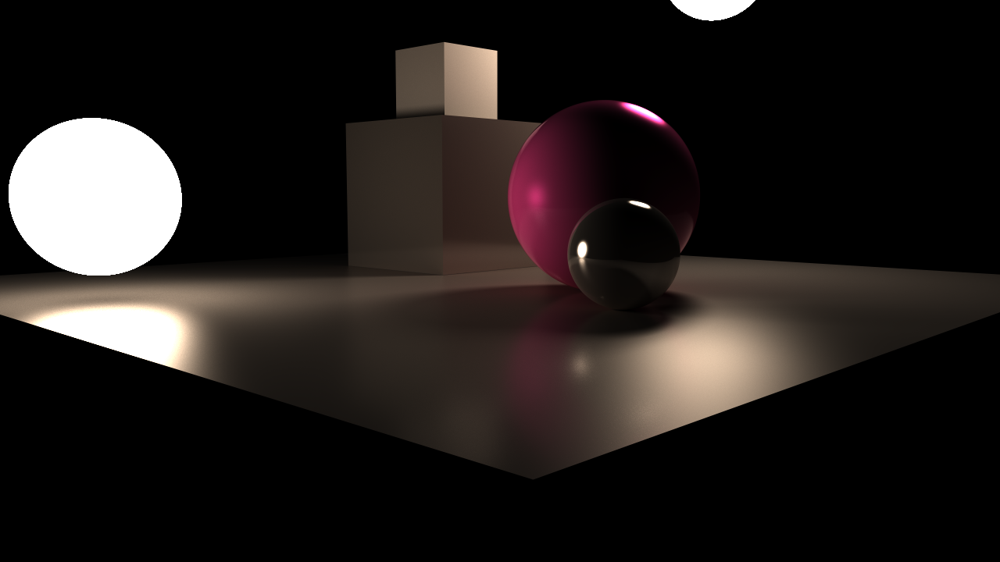
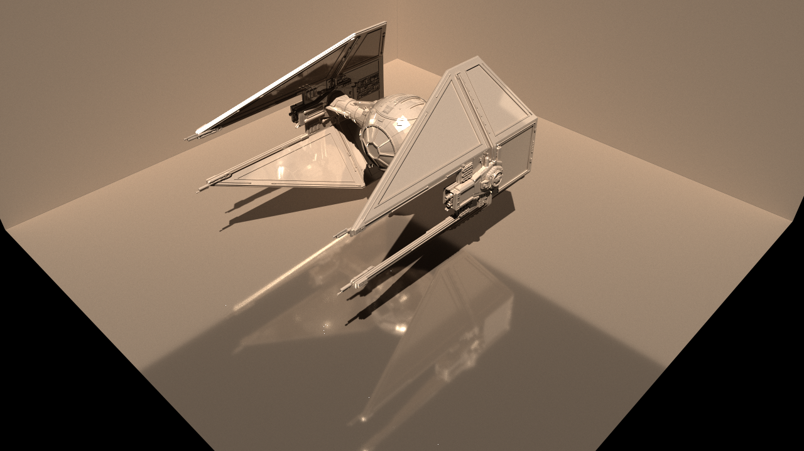

Light Bender
============


Light Bender is a multi-platform, GPU-accelerated, C++ rendering application written around the NVIDIA [OptiX](https://developer.nvidia.com/optix) Ray Tracing API. [Video](https://vimeo.com/200926842)

Key features:
* Ray tracing and light propagation code is handled on the GPU via OptiX ray tracing functions and CUDA kernels allowing for a significant speed up over CPU-based renderers.
* CMake build files are used to allow for cross platform compilation on Linux, OS X, and Windows.
* Monte Carlo random sampling is utilized to accurately compute the lighting equation integral.
  * Importance sampling of BSDFs is used to reduce variance and degrease convergence times.
  * Russian roulette path selection is used to probabilistically select a single reflection, transmission, or absorption path on each render pass (also reducing convergence times).
* Real-time user manipulation of materials and camera settings is available through an on screen UI. 


Download
--------
Make sure to clone all submodules as well:

```bash
git clone --recursive https://github.com/LoganBarnes/LightBender.git
```

If the project was already cloned without submodules use this command from the root folder:

```bash
git submodule update --init --recursive
```


Environment
-----------

Ensure the OptiX SDK locations are added to the environment paths before attempting to build and run.

On Unix this can be done by adding the following lines to your .bashrc, .profile, etc. (or manually typing them into the terminal each time).

```bash
# CUDA environment
export PATH=<path/to/your/cuda>/bin:$PATH
export LD_LIBRARY_PATH=<path/to/your/cuda>/lib64:$LD_LIBRARY_PATH

# OptiX
export OPTIX_SDK=<path/to/your/optix/sdk>
export LD_LIBRARY_PATH=$OPTIX_SDK/lib64:$LD_LIBRARY_PATH
```

On Windows you will have to set environment variables through the environment variables GUI.

Once the environment variables are set, run the appropriate *configureAndBuild* script from the *run* directory via the terminal or console.

Build and Run
-------------


### Unix

```bash
cd run
./unixConfigureAndBuild.sh
./bin/runLightBender
```


### Windows

```bash
cd run
winConfigureAndBuild.cmd
bin\runLightBender.exe
```


Renderings
----------

#### Images showcasing the current status of the project





#### Direct illumination (directly from a light source):


#### Indirect illumination (light scattered and reflected off objects):


#### Direct and indirect illumination together:


